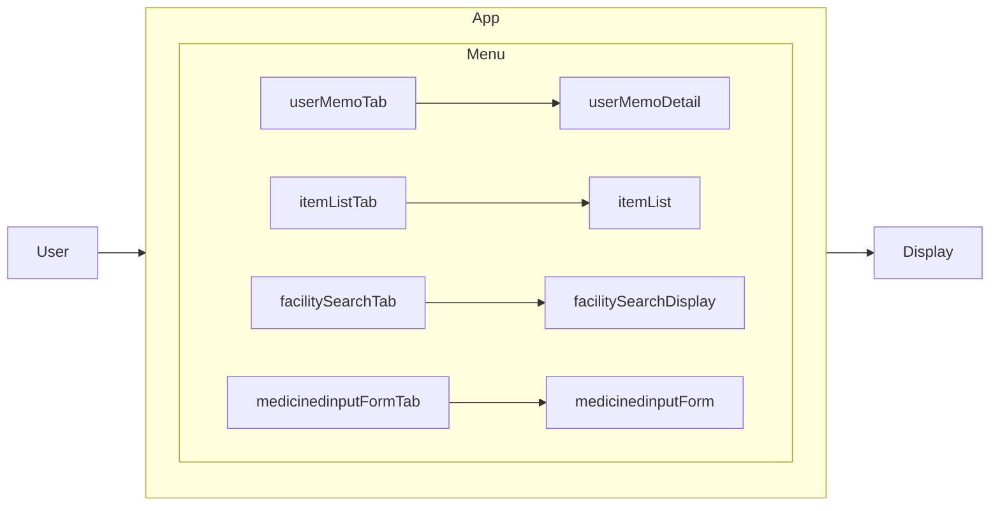
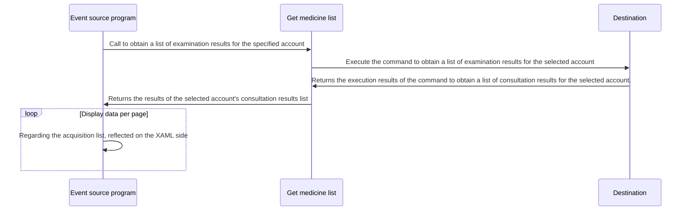
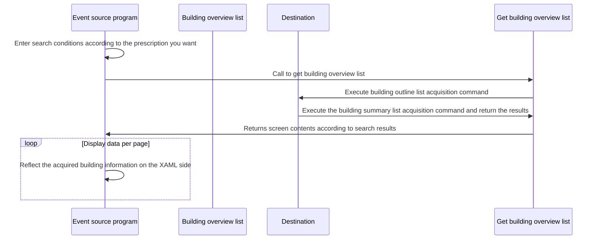
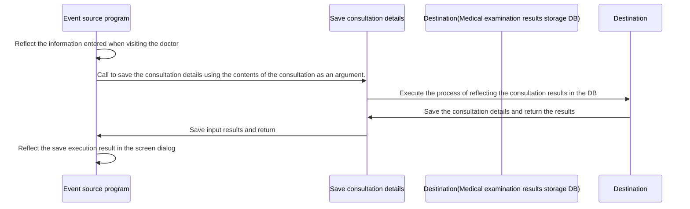

#project overview

It's a repository where I tried out a framework while other people were developing it on Spajam.

## Technical configuration

### Development environment

Visual Studio 2022 compatible

### Creating each page

Created using .Net MAUI template file

### Reference materials when creating materials

https://github.blog/2022-02-14-include-diagrams-markdown-files-mermaid/

### ReleasePlan LastFlow

#### Planned implementation details for each screen
##### List of past consultations
##### Screen side overview
Display the consultation history list of saved contents on the input screen
Click on the consultation history to go to the details screen

##### data transition

##### Building search screen
##### Screen overview
A screen where you can receive medicine under specified conditions
Click on the displayed building information to move to the details screen
##### data transition

##### Consultation result input screen
###### Screen overview
Enter details at the time of consultation
####### Input items
Click on the displayed building information to move to the detailed screen

   Pharmacy name(Branch name)
   Medical institution name(University Hospital)
   name(Name at the time of purchase, name of agent or principal)
   date of birth(Target person's birthday Will be moved once the account page is created)

##### data transition

