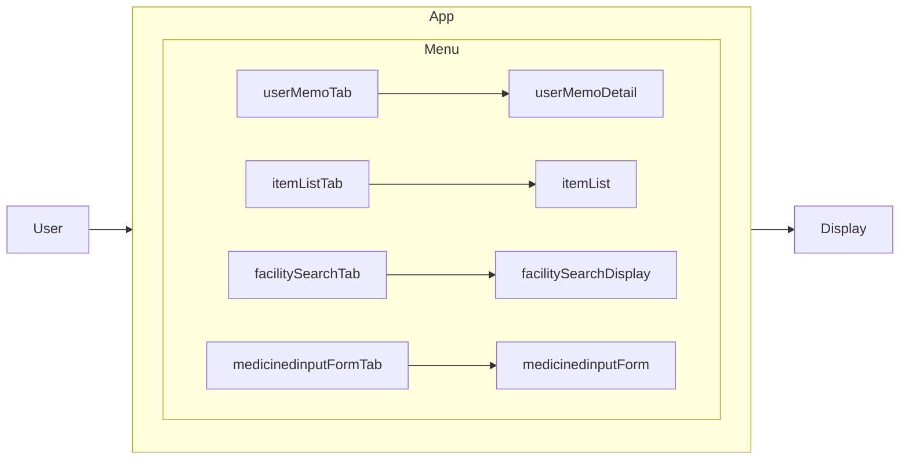

#このプロジェクトについて

Spajamでみんながスマホアプリを進めていたからやってみたよ。

## 技術構成

### 開発環境

VisualStudio2022対応

### 各ページの作成

.Net MAUIのテンプレートファイルを使って作成

### 資料作成時の参考資料

https://github.blog/2022-02-14-include-diagrams-markdown-files-mermaid/

### メニュー画面の最終的な遷移(ReleasePlan LastFlow)
