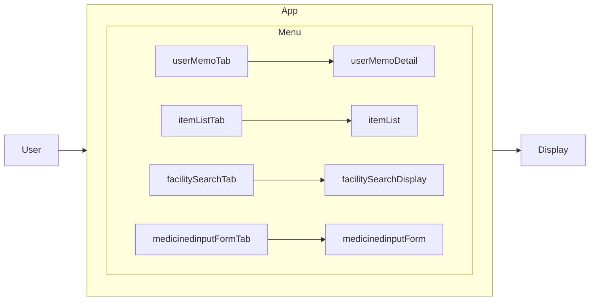
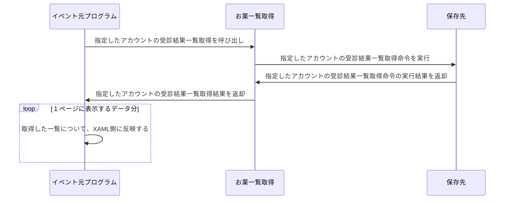
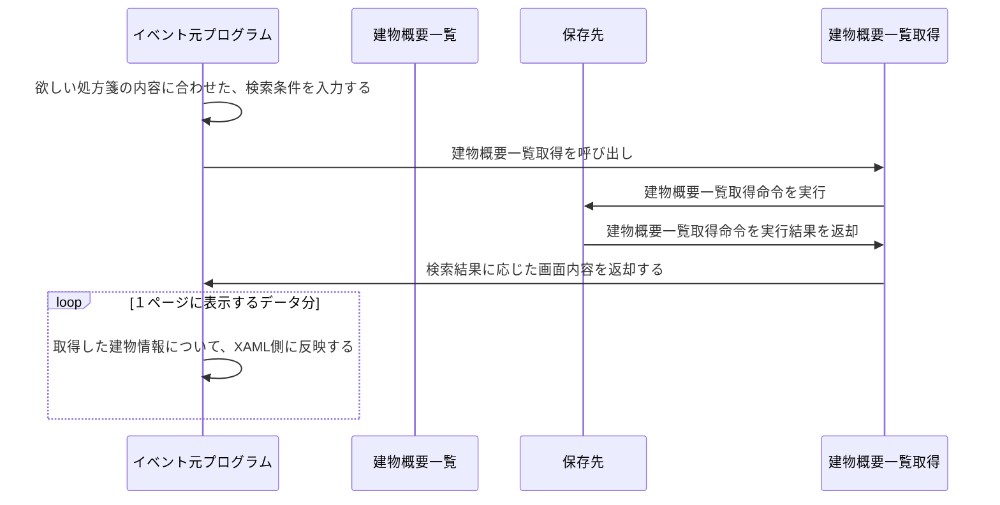
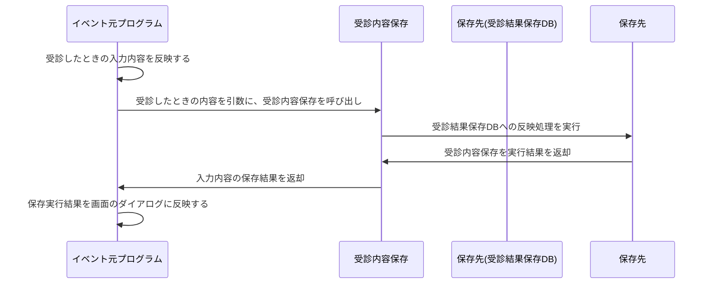

#このプロジェクトについて

Spajamでみんながスマホアプリを進めていたからやってみたよ。

## 技術構成

### 開発環境

VisualStudio2022対応

### 各ページの作成

.Net MAUIのテンプレートファイルを使って作成

### 資料作成時の参考資料

https://github.blog/2022-02-14-include-diagrams-markdown-files-mermaid/

### メニュー画面の最終的な遷移(ReleasePlan LastFlow)

#### 各画面の実装予定内容
##### 過去の受診内容一覧
##### 画面側概要
入力画面で保存した内容の受診履歴一覧を表示する
受診履歴をクリックすることで詳細画面へ遷移する
##### データ遷移

##### 建物検索画面
##### 画面側概要
指定した条件で、お薬をもらえる画面
表示された建物情報をクリックすることで詳細画面へ遷移する
##### データ遷移

##### 受診結果入力画面
##### 画面側概要
受診した時の内容を入力する
###### 入力項目
表示された建物情報をクリックすることで詳細画面へ遷移する

   薬局名(〇〇支店名)
   医療機関名(△△大学病院)
   お名前(購入時の名前　代理人とか本人の名前とか)
   生年月日(対象者の誕生日 アカウントページができたら移動予定)

##### データ遷移

